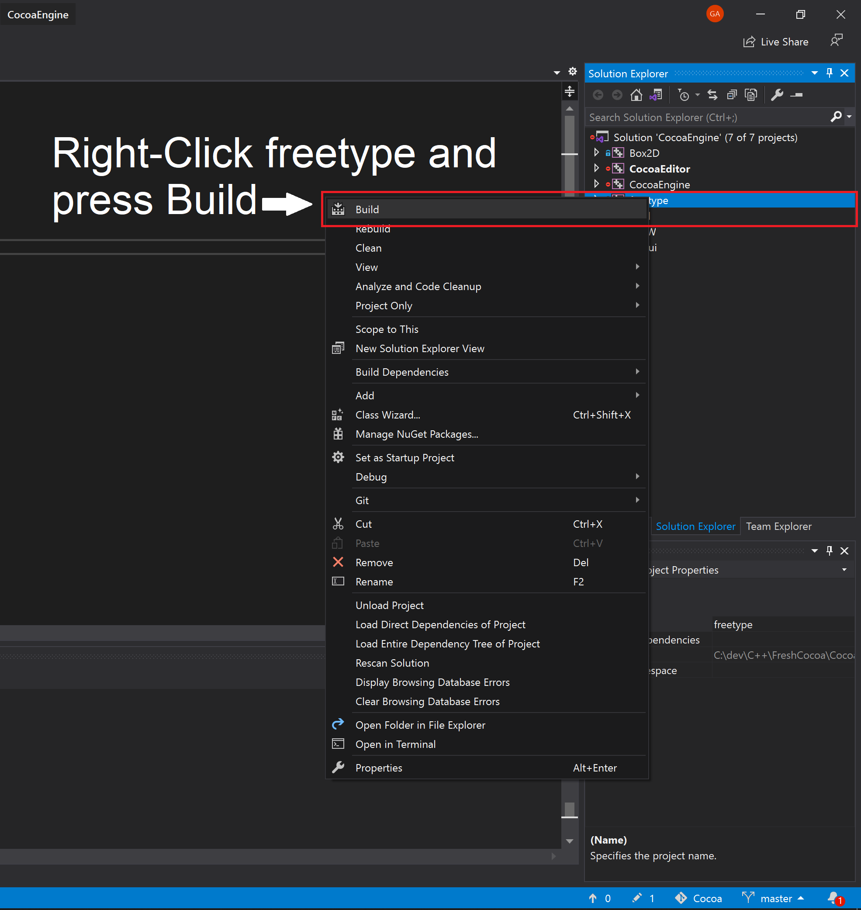

# Cocoa Engine
Welcome to Cocoa Engine, this is a 2D game engine independently developed by me, Gabe Ambrosio (AKA GamesWithGabe).  The engine is currently in development, for the most recent stable build please follow the following steps on the *master* branch. 

## Quickstart
In order to run this, you'll have to run a few commands. First, open up a powershell window in a directory you would like to contain the engine source code. (The engine currently only supports Windows, so this will not work on Linux *yet*).

Next run these commands:
```
git clone --recursive https://github.com/ambrosiogabe/Cocoa
cd Cocoa
build.bat
```

These commands will clone the repository into your directory, update the submodules (this step takes awhile because of all the code). 

After that, simply double click the VisualStudio solution file that was (hopefully) generated, and then once it opens press F5 to run. This will compile *almost* all the projects, unfortunately I can't get FreeType to build in order ***yet***. So, for now, the build will fail the first time, then just right-click the ```freetype``` project in the right-hand panel in visual studio and click ```build```. 



If all this works properly, you should be able to press F5 once again and then be presented with a window saying to create a project or open a Cocoa project.

***NOTE***: This only works with VisualStudio 2019 right now, I will add support for more versions and more editor hopefully in the near future.

## Feature Requests

If you are using this and happen to have any features you would like to request, please submit an issue at: https://github.com/ambrosiogabe/Cocoa/issues . Prefix the title with FEATURE REQUEST, and provide as much information as possible.

## Bug Reporting

This engine is still very much in development, there are no official releases yet, however bug reporting is still very helpful so I can keep track of everything. If you encounter any bugs please report them at the issues tab of the repository at: https://github.com/ambrosiogabe/Cocoa/issues .

Follow this template when reporting the bug:

```markdown 
## Describe the bug
A clear and concise description of what the bug is.

## To Reproduce
Steps to reproduce the behavior:

1. Go to '...'
2. Click on '....'
3. Scroll down to '....'
4. See error

## Expected behavior
A clear and concise description of what you expected to happen.

## Screenshots
If applicable, add screenshots to help explain your problem.

## Desktop (please complete the following information):
OS: [e.g. Windows 10, Linux, MacOS]

## Additional context
Add any other context about the problem here.
```


